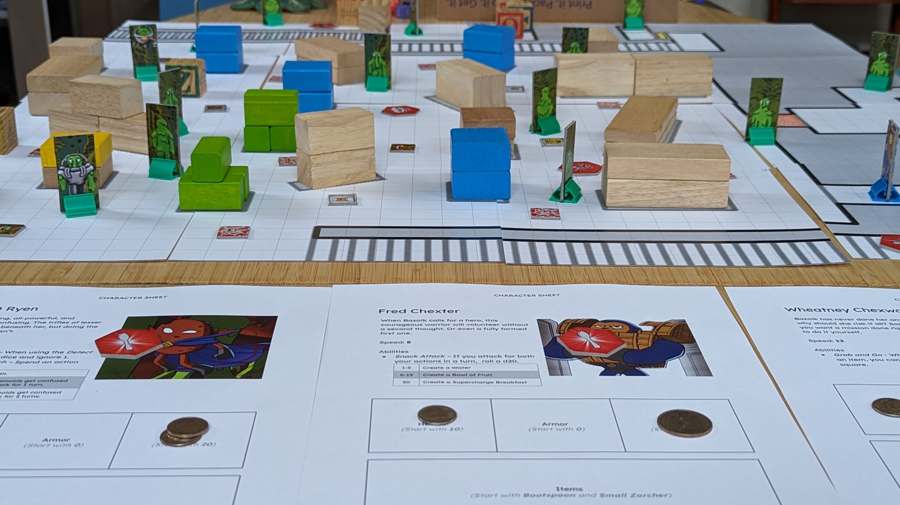
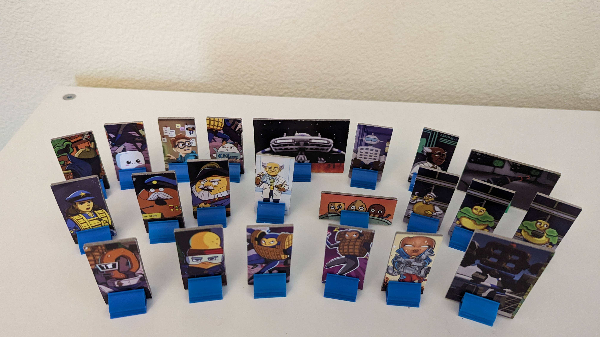
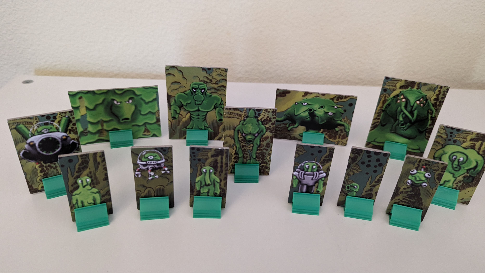
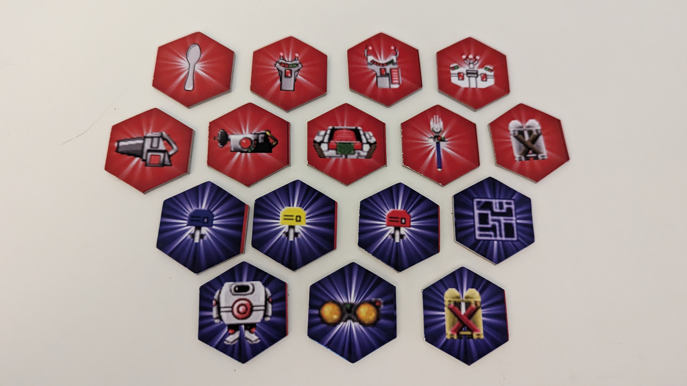
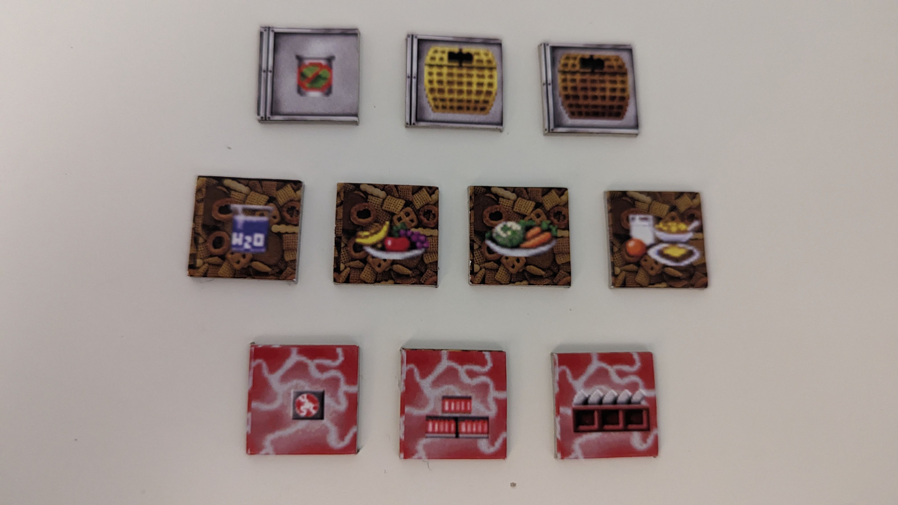
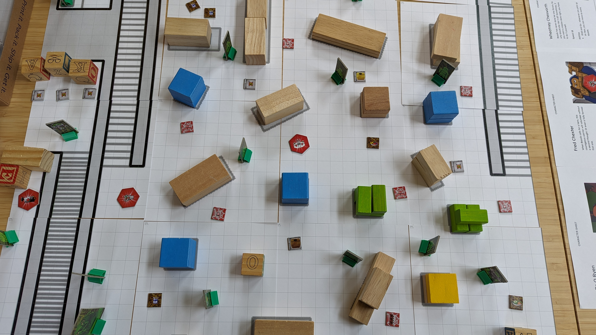
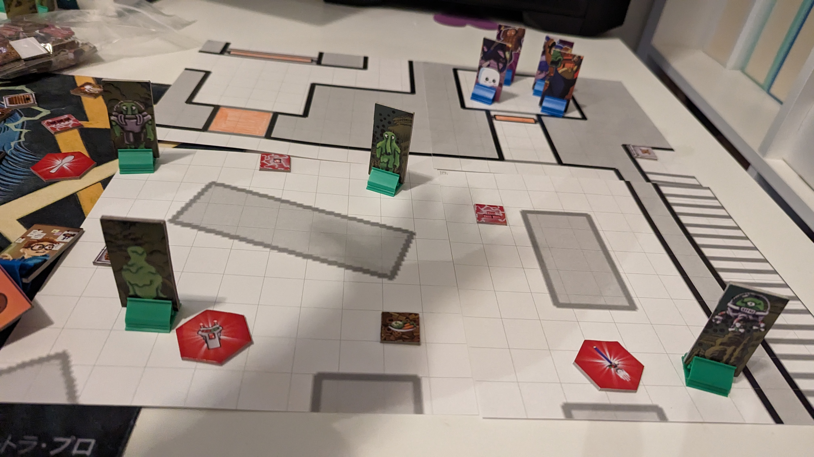

# CQRPG _(Chex Quest Role-Playing Game)_

CQRPG is a casual table-top role-playing game, based on the Chex Quest computer game series.

## Print and Play

Print the following files to make your own copy:
* [Rules](https://github.com/GamesFaix/cqrpg/blob/main/docs/CQRPG%20Rules%20v1.pdf)
  * _Basic black-and-white document_
* [Character sheets](https://github.com/GamesFaix/cqrpg/blob/main/docs/CQRPG%20Character%20Sheets.pdf)
  * _Basic color document_
* [Token sheets](https://github.com/GamesFaix/cqrpg/tree/main/docs/tokens) 
  * _These are designed to fit the token sheet templates at [Print & Play Games](https://www.printplaygames.com/)._
  * _Sheets 1-3 use the 1"x2" rectangle template_
  * _Sheet 4 uses the 1.5"x2.33" rectangle template_
  * _Sheet 5 uses the 2"x2.75" rectangle template_
  * _Sheet 6 uses the 1.19" hexagon template_
  * _Sheet 7 uses the 0.75" square template_
* [Missions](https://github.com/GamesFaix/cqrpg/tree/main/docs/missions)
  * _Each mission includes a Briefing document to be held by the game master and a Sectors document for the table map._
  * _The Briefings are basic color documents._
  * _The Sectors should be printed on 8.5"x11" cardstock and cut to 8" squares._
  * _Currently only E1M2: Storage Facility is available._

Other supplies:
* Lots of coins to count health, armor, and zorch.
* Stands to hold tokens up. These are also available from Print & Play Games. You could also use binder clips available at any office supply store.

